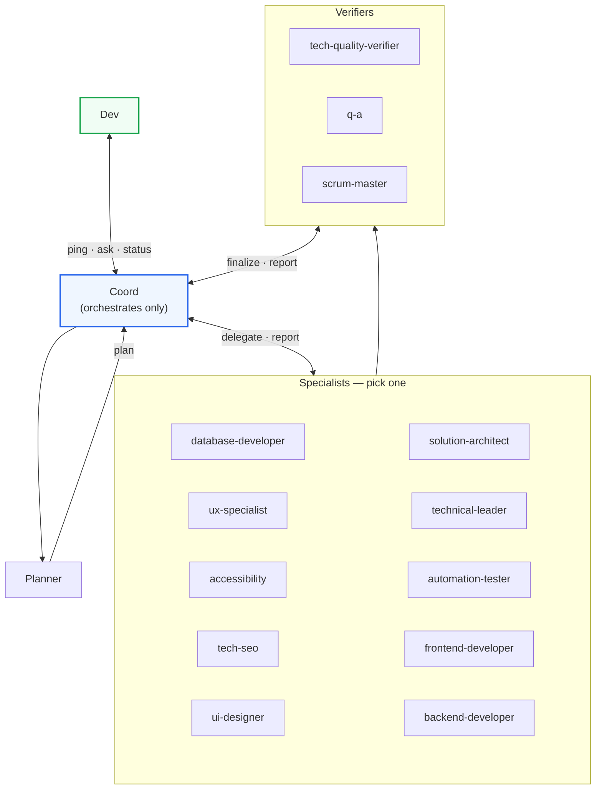

# Coord

Coord coordinates and finalizes; Planner produces the plan; specialists execute; Coord does not implement; dev decides if needed.

## Flow



## Sequences

```
Happy:  Dev -> Coord -> Planner -> Coord -> Specialist -> Verifier -> Coord -> Dev (DONE)
Miss:   Dev -> Coord -> Catalog miss -> Dev (ERROR)
Block:  Specialist/Verifier -> Coord -> Dev (ping) -> Coord -> resume
```
