# Gaming Module — Backend Plan

**API Style:** REST  
**Auth:** Supabase Bearer JWT (Bearer header)  
**Realtime:** WebSocket — bidirectional game-play channel (answer submission + question / timer / score events)

---

## Section 1 — Flow Diagrams

### GET /api/v1/rooms

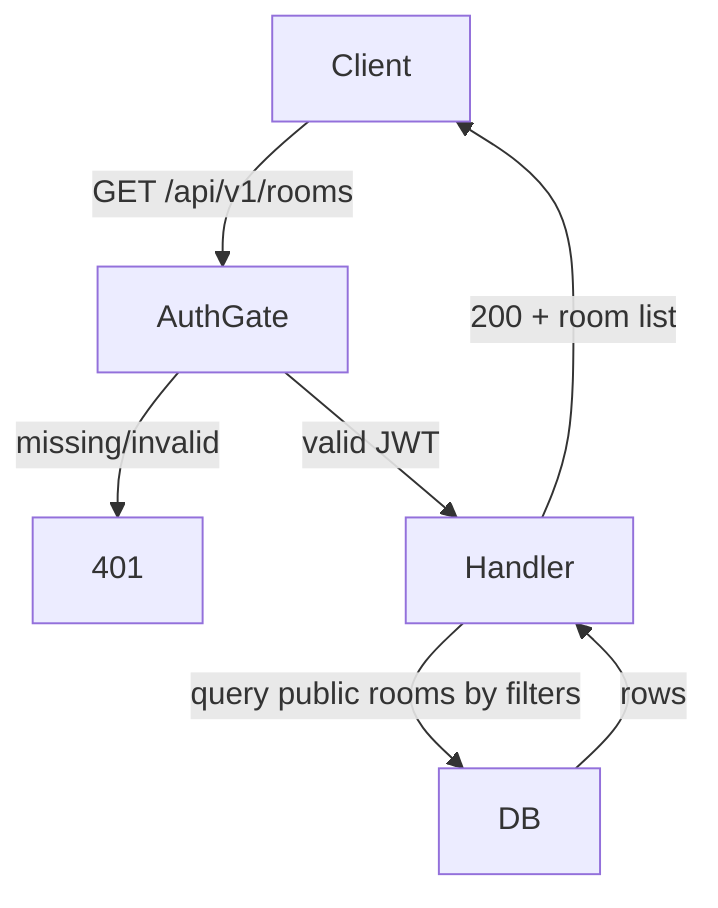

### POST /api/v1/rooms

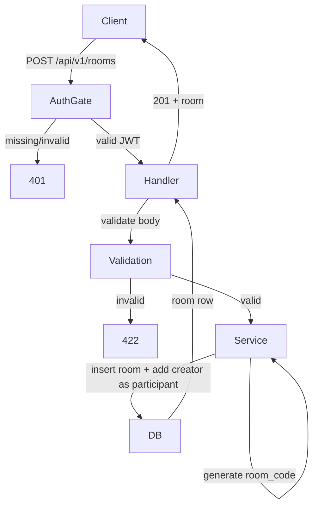

### GET /api/v1/rooms/{roomId}

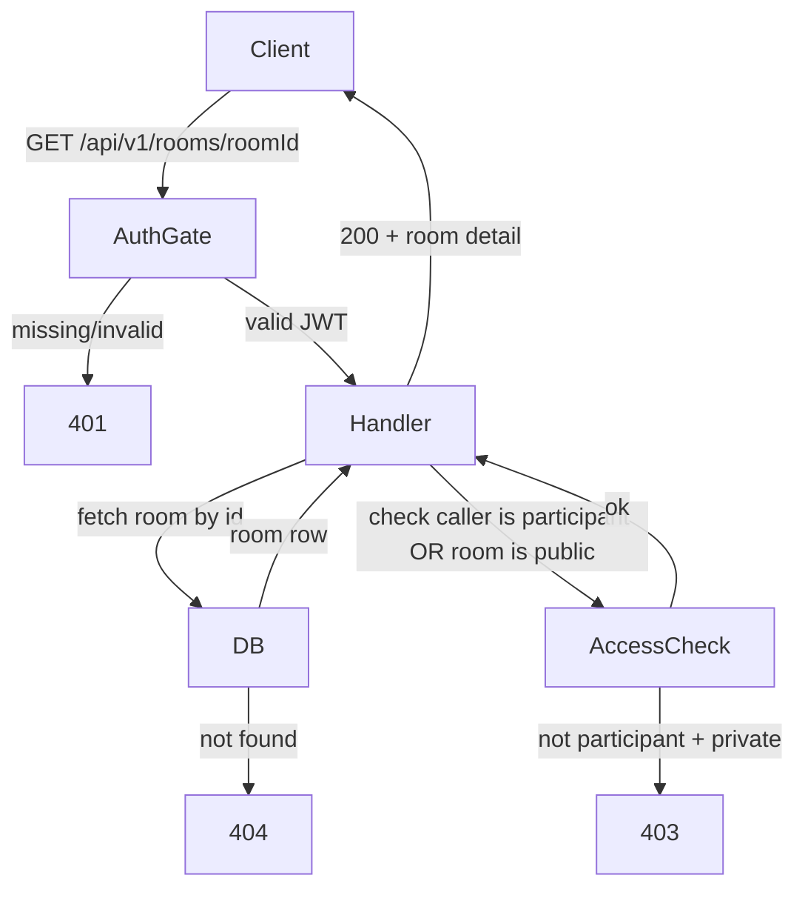

### GET /api/v1/rooms/{roomId}/participants

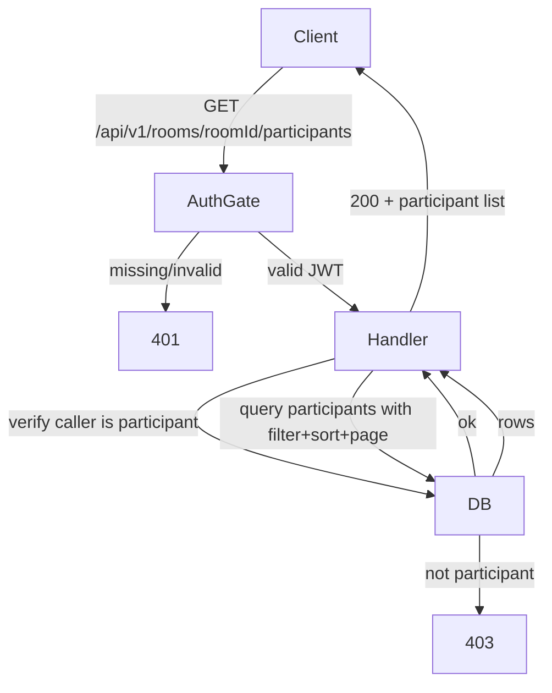

### POST /api/v1/rooms/{roomId}/participants

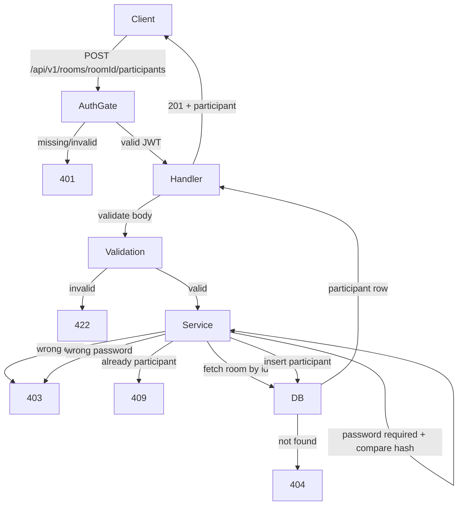

### DELETE /api/v1/rooms/{roomId}/participants/{userId}

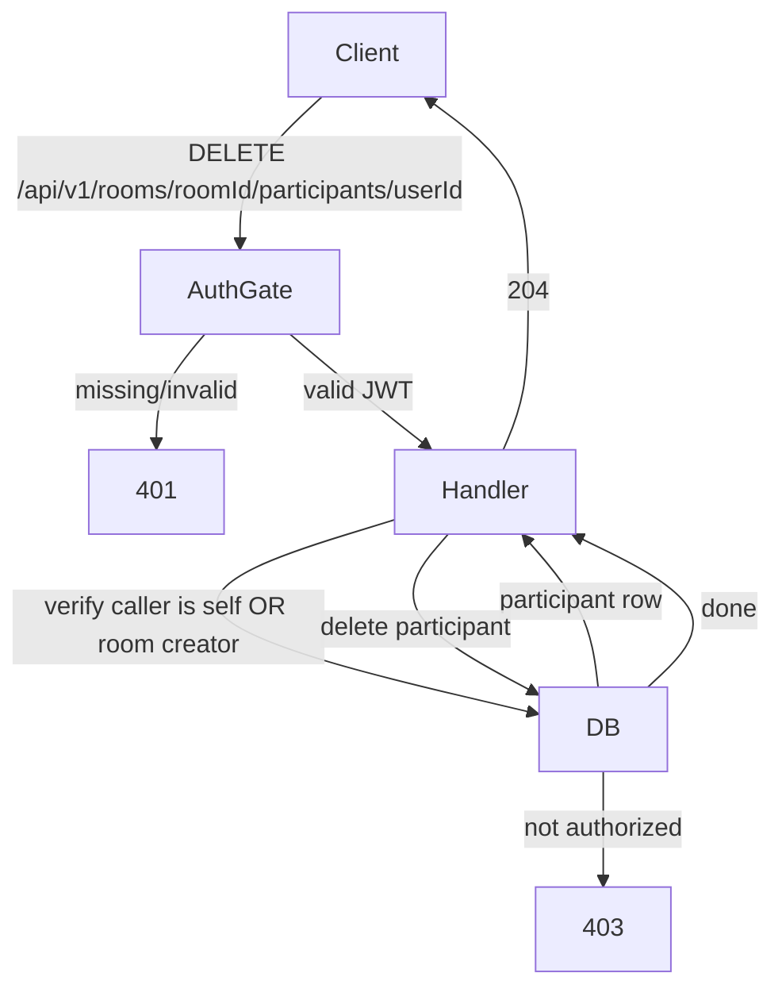

### GET /api/v1/rooms/{roomId}/games

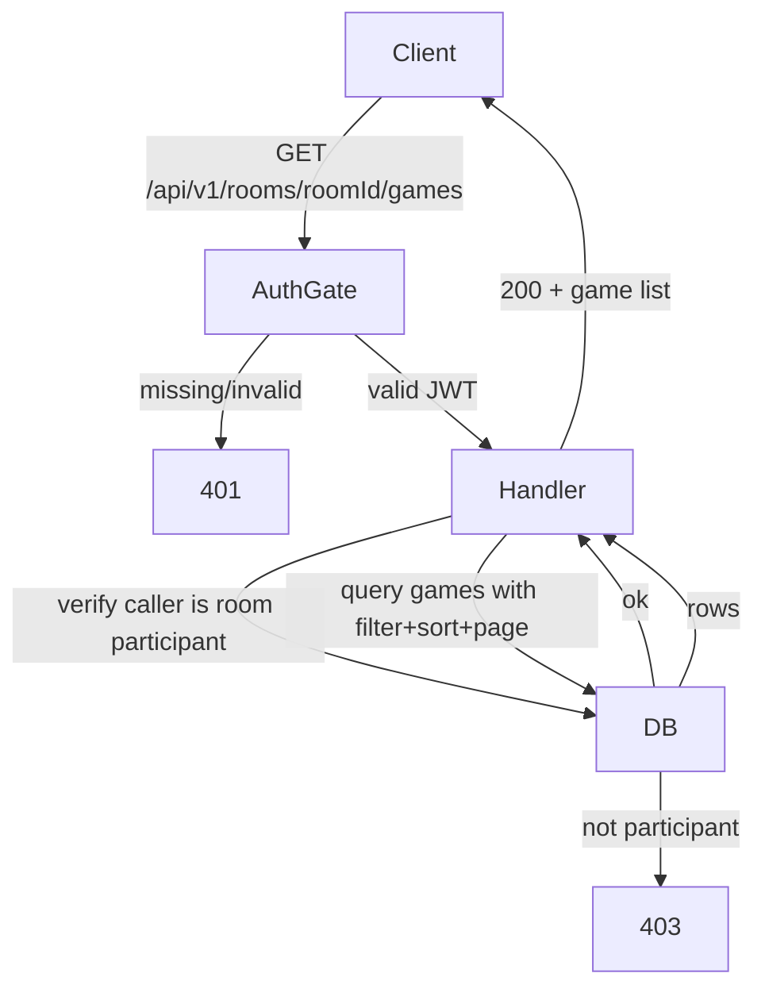

### POST /api/v1/rooms/{roomId}/games

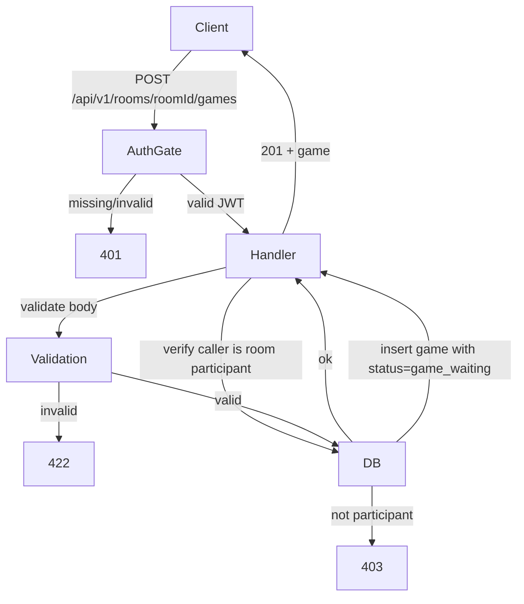

### POST /api/v1/games/{gameId}/players

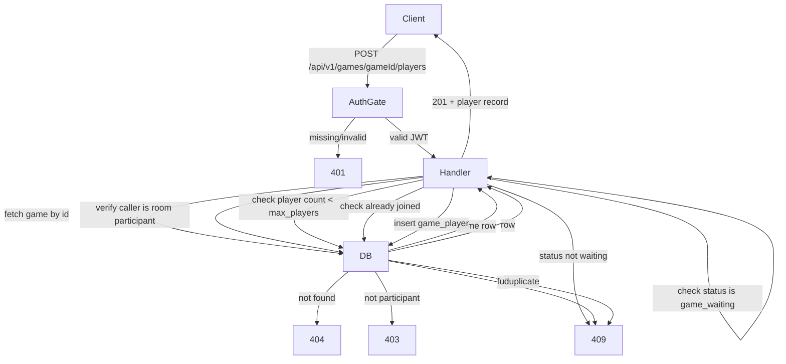

### DELETE /api/v1/games/{gameId}/players/{userId}

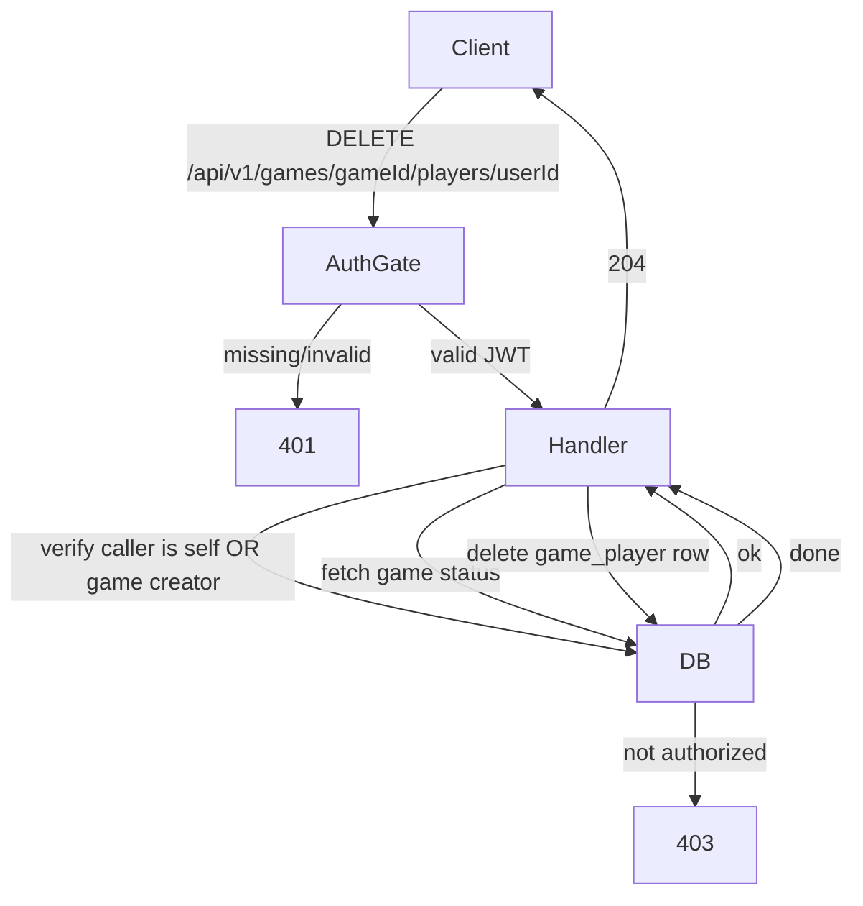

### PATCH /api/v1/games/{gameId}

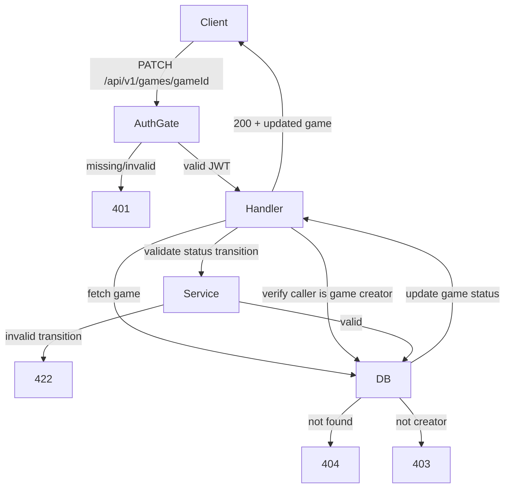

### GET /api/v1/games/{gameId}/summary

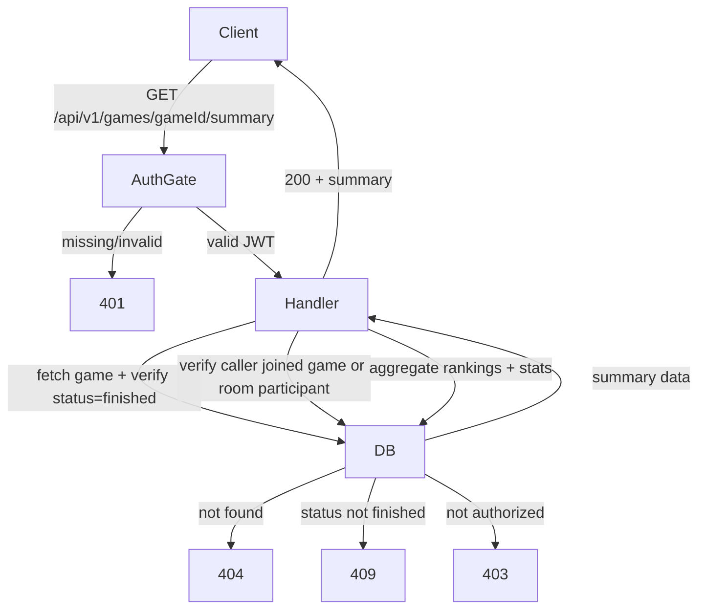

### WS /api/v1/games/{gameId}/play

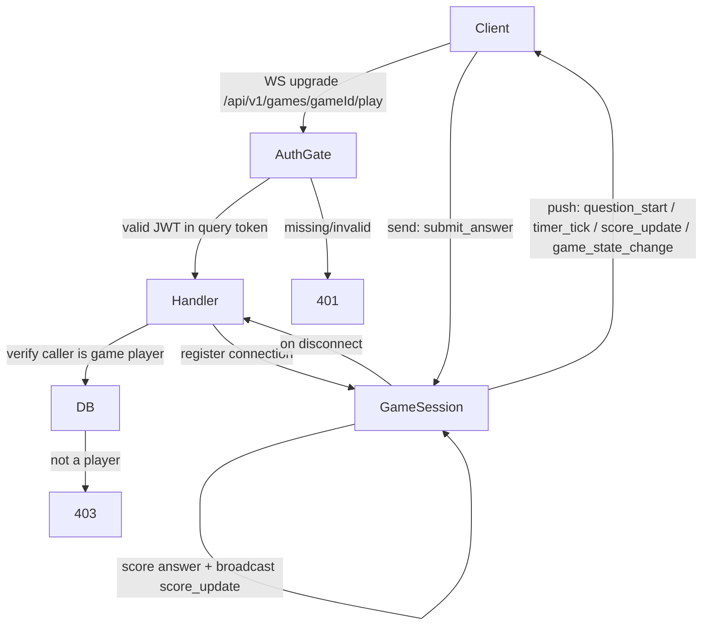

---

## Section 2 — Endpoint Index

| Method    | Path                                          | Auth     | Summary                                              |
| --------- | --------------------------------------------- | -------- | ---------------------------------------------------- |
| GET       | /api/v1/rooms                                 | Required | List public rooms; supports `search` and `code` query params |
| POST      | /api/v1/rooms                                 | Required | Create a new room                                    |
| GET       | /api/v1/rooms/{roomId}                        | Required | Get room detail (participants must be in room or room is public) |
| GET       | /api/v1/rooms/{roomId}/participants           | Required | List room participants with filter and sort          |
| POST      | /api/v1/rooms/{roomId}/participants           | Required | Join room — validates room_code and optional password |
| DELETE    | /api/v1/rooms/{roomId}/participants/{userId}  | Required | Remove participant (self or room creator only)       |
| GET       | /api/v1/rooms/{roomId}/games                  | Required | List games in room with filter and sort              |
| POST      | /api/v1/rooms/{roomId}/games                  | Required | Create game in room                                  |
| POST      | /api/v1/games/{gameId}/players                | Required | Join a game (must be room participant, game in waiting state) |
| DELETE    | /api/v1/games/{gameId}/players/{userId}       | Required | Leave / remove player from game                      |
| PATCH     | /api/v1/games/{gameId}                        | Required | Update game status (game creator only: start or end) |
| GET       | /api/v1/games/{gameId}/summary                | Required | Get finished-game summary with rankings and stats    |
| WS        | /api/v1/games/{gameId}/play                   | Required | Bidirectional game-play channel (token in query param) |

---

## Section 3 — Endpoint Behaviors

### GET /api/v1/rooms

```
Auth: Bearer token required → 401 if missing or invalid
Input: query { search?, code?, page?, limit? }
Flow: verify auth
      if code provided → filter by exact room_code match (finds private rooms too)
      else → filter where visibility = 'public'
      apply search filter on name if provided
      apply pagination
      return 200 + room list
```

### POST /api/v1/rooms

```
Auth: Bearer token required → 401 if missing or invalid
Input: body { name, visibility: 'public'|'private', password? }
Flow: verify auth
      validate body → 422 on failure
      if password provided → bcrypt hash the password
      generate unique room_code (short alphanumeric, retry on collision)
      insert room row with creator_id = caller's user id
      insert room_participants row for creator
      return 201 + room (including room_code)
```

### GET /api/v1/rooms/{roomId}

```
Auth: Bearer token required → 401 if missing or invalid
Input: path { roomId }
Flow: verify auth
      fetch room by roomId → 404 if not found
      if room visibility = 'private' → check caller is participant → 403 if not
      return 200 + room detail (name, code, visibility, participant count, creator)
```

### GET /api/v1/rooms/{roomId}/participants

```
Auth: Bearer token required → 401 if missing or invalid
Input: path { roomId }, query { filterUserName?, sortBy?: 'user_name', sortDir?: 'asc'|'desc', page?, limit? }
Flow: verify auth
      verify caller is participant of roomId → 403 if not
      query participants filtered by filterUserName (ilike) if provided
      apply sort: default asc user_name
      apply pagination
      return 200 + participant list
```

### POST /api/v1/rooms/{roomId}/participants

```
Auth: Bearer token required → 401 if missing or invalid
Input: path { roomId }, body { roomCode, roomPassword? }
Flow: verify auth
      validate body → 422 on failure
      fetch room by roomId → 404 if not found
      compare provided roomCode to room.code → 403 if mismatch
      if room has password → compare bcrypt hash(roomPassword, room.password_hash) → 403 if mismatch
      check caller not already a participant → 409 if duplicate
      insert room_participants row
      return 201 + participant record
```

### DELETE /api/v1/rooms/{roomId}/participants/{userId}

```
Auth: Bearer token required → 401 if missing or invalid
Input: path { roomId, userId }
Flow: verify auth
      fetch room → 404 if not found
      fetch participant row for userId in roomId → 404 if not found
      check caller = userId (self-removal) OR caller = room.creator_id → 403 if neither
      delete participant row
      return 204
```

### GET /api/v1/rooms/{roomId}/games

```
Auth: Bearer token required → 401 if missing or invalid
Input: path { roomId }, query { filterCategory?, filterGameName?, sortBy?: 'order'|'category'|'game_name', sortDir?: 'asc'|'desc', page?, limit? }
Flow: verify auth
      verify caller is participant of roomId → 403 if not
      query games where room_id = roomId
      apply category filter if provided
      apply game_name ilike filter if provided
      apply sort (default: order asc)
      apply pagination
      return 200 + game list (including status, player count)
```

### POST /api/v1/rooms/{roomId}/games

```
Auth: Bearer token required → 401 if missing or invalid
Input: path { roomId }, body { name, type: 'casual', maxPlayers, timePerQuestion, category, difficulty: 'Easy'|'Medium'|'Hard', description? }
Flow: verify auth
      verify caller is participant of roomId → 403 if not
      validate body → 422 on failure
      insert game row with status = 'game_waiting', creator_id = caller, room_id = roomId
      return 201 + game
```

### POST /api/v1/games/{gameId}/players

```
Auth: Bearer token required → 401 if missing or invalid
Input: path { gameId }
Flow: verify auth
      fetch game by gameId → 404 if not found
      verify caller is participant of game's room → 403 if not
      check game status = 'game_waiting' → 409 if not waiting
      count current game_players → 409 if count >= game.max_players
      check caller not already a player → 409 if duplicate
      insert game_players row with score = 0
      return 201 + player record
```

### DELETE /api/v1/games/{gameId}/players/{userId}

```
Auth: Bearer token required → 401 if missing or invalid
Input: path { gameId, userId }
Flow: verify auth
      fetch game → 404 if not found
      fetch game_players row for userId → 404 if not found
      check caller = userId (self-removal) OR caller = game.creator_id → 403 if neither
      delete game_players row
      return 204
```

### PATCH /api/v1/games/{gameId}

```
Auth: Bearer token required → 401 if missing or invalid
Input: path { gameId }, body { status: 'game_pending' | 'game_finished' }
Flow: verify auth
      fetch game by gameId → 404 if not found
      verify caller = game.creator_id → 403 if not
      validate transition:
        game_waiting → game_pending: valid
        game_pending → game_finished: valid
        any other transition → 422
      update game status
      if transitioning to game_pending → select questions from question_bank by category/difficulty, insert game_questions
      return 200 + updated game
```

### GET /api/v1/games/{gameId}/summary

```
Auth: Bearer token required → 401 if missing or invalid
Input: path { gameId }
Flow: verify auth
      fetch game by gameId → 404 if not found
      check game status = 'game_finished' → 409 if not finished
      verify caller is game player OR room participant → 403 if neither
      aggregate player scores sorted desc → rankings
      count total game_questions for game → total question count
      calculate total_time = question_count * time_per_question
      return 200 + { rankings, totalQuestions, totalTime, gameName }
```

### WS /api/v1/games/{gameId}/play

```
Auth: Bearer token required in query param `token` → 401 if missing or invalid
Input: path { gameId }, query { token }
Flow: verify auth from token query param
      fetch game → 404 if not found
      verify caller is a game player → 403 if not
      register WebSocket connection in game session
      server → client events:
        question_start: { questionId, content, type, options?, scale?, index, total, duration }
        timer_tick: { questionId, remaining }
        score_update: { scores: [{ userId, displayName, score }] }
        game_state_change: { status: 'game_pending' | 'game_finished' }
      client → server messages:
        submit_answer: { questionId, answer }
          → validate answer not already submitted → score → broadcast score_update
      on disconnect: unregister connection; if game creator disconnects, pause timer
```

---

## Section 4 — Zod Server-Contract Schemas

### GET /api/v1/rooms

```ts
import z from 'zod';

export const schema = () =>
  z.object({
    in: z.object({
      query: z.object({
        search: z.string().optional(),
        code: z.string().optional(),
        page: z.coerce.number().int().positive().optional(),
        limit: z.coerce.number().int().positive().max(50).optional(),
      }),
      path: z.object({}),
      payload: z.object({}),
    }),
    out: z.union([
      z.object({
        code: z.literal(200),
        rooms: z.array(
          z.object({
            id: z.string().uuid(),
            name: z.string(),
            roomCode: z.string(),
            visibility: z.enum(['public', 'private']),
            participantCount: z.number().int(),
            createdAt: z.string().datetime(),
          }),
        ),
        total: z.number().int(),
      }),
      z.object({
        code: z.literal(401),
        type: z.literal('unauthorized'),
        message: z.string(),
      }),
      z.object({
        code: z.literal(500),
        type: z.literal('internal-server'),
        message: z.string(),
      }),
    ]),
  });

export type Schema = z.infer<ReturnType<typeof schema>>;
```

### POST /api/v1/rooms

```ts
import z from 'zod';

export const schema = () =>
  z.object({
    in: z.object({
      query: z.object({}),
      path: z.object({}),
      payload: z.object({
        name: z.string().min(1).max(100),
        visibility: z.enum(['public', 'private']),
        password: z.string().min(1).max(100).optional(),
      }),
    }),
    out: z.union([
      z.object({
        code: z.literal(201),
        room: z.object({
          id: z.string().uuid(),
          name: z.string(),
          roomCode: z.string(),
          visibility: z.enum(['public', 'private']),
          hasPassword: z.boolean(),
          createdAt: z.string().datetime(),
        }),
      }),
      z.object({
        code: z.literal(400),
        type: z.literal('bad-request'),
        message: z.string(),
      }),
      z.object({
        code: z.literal(401),
        type: z.literal('unauthorized'),
        message: z.string(),
      }),
      z.object({
        code: z.literal(422),
        type: z.literal('validation-error'),
        errors: z.array(z.object({ field: z.string(), message: z.string() })),
      }),
      z.object({
        code: z.literal(500),
        type: z.literal('internal-server'),
        message: z.string(),
      }),
    ]),
  });

export type Schema = z.infer<ReturnType<typeof schema>>;
```

### GET /api/v1/rooms/{roomId}

```ts
import z from 'zod';

export const schema = () =>
  z.object({
    in: z.object({
      query: z.object({}),
      path: z.object({
        roomId: z.string().uuid(),
      }),
      payload: z.object({}),
    }),
    out: z.union([
      z.object({
        code: z.literal(200),
        room: z.object({
          id: z.string().uuid(),
          name: z.string(),
          roomCode: z.string(),
          visibility: z.enum(['public', 'private']),
          hasPassword: z.boolean(),
          creatorId: z.string().uuid(),
          participantCount: z.number().int(),
          createdAt: z.string().datetime(),
        }),
      }),
      z.object({
        code: z.literal(401),
        type: z.literal('unauthorized'),
        message: z.string(),
      }),
      z.object({
        code: z.literal(403),
        type: z.literal('forbidden'),
        message: z.string(),
      }),
      z.object({
        code: z.literal(404),
        type: z.literal('not-found'),
        message: z.string(),
      }),
      z.object({
        code: z.literal(500),
        type: z.literal('internal-server'),
        message: z.string(),
      }),
    ]),
  });

export type Schema = z.infer<ReturnType<typeof schema>>;
```

### GET /api/v1/rooms/{roomId}/participants

```ts
import z from 'zod';

export const schema = () =>
  z.object({
    in: z.object({
      query: z.object({
        filterUserName: z.string().optional(),
        sortBy: z.enum(['user_name']).optional(),
        sortDir: z.enum(['asc', 'desc']).optional(),
        page: z.coerce.number().int().positive().optional(),
        limit: z.coerce.number().int().positive().max(100).optional(),
      }),
      path: z.object({
        roomId: z.string().uuid(),
      }),
      payload: z.object({}),
    }),
    out: z.union([
      z.object({
        code: z.literal(200),
        participants: z.array(
          z.object({
            userId: z.string().uuid(),
            displayName: z.string(),
            joinedAt: z.string().datetime(),
          }),
        ),
        total: z.number().int(),
      }),
      z.object({
        code: z.literal(401),
        type: z.literal('unauthorized'),
        message: z.string(),
      }),
      z.object({
        code: z.literal(403),
        type: z.literal('forbidden'),
        message: z.string(),
      }),
      z.object({
        code: z.literal(404),
        type: z.literal('not-found'),
        message: z.string(),
      }),
      z.object({
        code: z.literal(500),
        type: z.literal('internal-server'),
        message: z.string(),
      }),
    ]),
  });

export type Schema = z.infer<ReturnType<typeof schema>>;
```

### POST /api/v1/rooms/{roomId}/participants

```ts
import z from 'zod';

export const schema = () =>
  z.object({
    in: z.object({
      query: z.object({}),
      path: z.object({
        roomId: z.string().uuid(),
      }),
      payload: z.object({
        roomCode: z.string().min(1),
        roomPassword: z.string().min(1).optional(),
      }),
    }),
    out: z.union([
      z.object({
        code: z.literal(201),
        participant: z.object({
          userId: z.string().uuid(),
          displayName: z.string(),
          joinedAt: z.string().datetime(),
        }),
      }),
      z.object({
        code: z.literal(401),
        type: z.literal('unauthorized'),
        message: z.string(),
      }),
      z.object({
        code: z.literal(403),
        type: z.literal('forbidden'),
        message: z.string(),
      }),
      z.object({
        code: z.literal(404),
        type: z.literal('not-found'),
        message: z.string(),
      }),
      z.object({
        code: z.literal(409),
        type: z.literal('conflict'),
        message: z.string(),
      }),
      z.object({
        code: z.literal(422),
        type: z.literal('validation-error'),
        errors: z.array(z.object({ field: z.string(), message: z.string() })),
      }),
      z.object({
        code: z.literal(500),
        type: z.literal('internal-server'),
        message: z.string(),
      }),
    ]),
  });

export type Schema = z.infer<ReturnType<typeof schema>>;
```

### DELETE /api/v1/rooms/{roomId}/participants/{userId}

```ts
import z from 'zod';

export const schema = () =>
  z.object({
    in: z.object({
      query: z.object({}),
      path: z.object({
        roomId: z.string().uuid(),
        userId: z.string().uuid(),
      }),
      payload: z.object({}),
    }),
    out: z.union([
      z.object({
        code: z.literal(204),
      }),
      z.object({
        code: z.literal(401),
        type: z.literal('unauthorized'),
        message: z.string(),
      }),
      z.object({
        code: z.literal(403),
        type: z.literal('forbidden'),
        message: z.string(),
      }),
      z.object({
        code: z.literal(404),
        type: z.literal('not-found'),
        message: z.string(),
      }),
      z.object({
        code: z.literal(500),
        type: z.literal('internal-server'),
        message: z.string(),
      }),
    ]),
  });

export type Schema = z.infer<ReturnType<typeof schema>>;
```

### GET /api/v1/rooms/{roomId}/games

```ts
import z from 'zod';

export const schema = () =>
  z.object({
    in: z.object({
      query: z.object({
        filterCategory: z.string().optional(),
        filterGameName: z.string().optional(),
        sortBy: z.enum(['order', 'category', 'game_name']).optional(),
        sortDir: z.enum(['asc', 'desc']).optional(),
        page: z.coerce.number().int().positive().optional(),
        limit: z.coerce.number().int().positive().max(50).optional(),
      }),
      path: z.object({
        roomId: z.string().uuid(),
      }),
      payload: z.object({}),
    }),
    out: z.union([
      z.object({
        code: z.literal(200),
        games: z.array(
          z.object({
            id: z.string().uuid(),
            name: z.string(),
            type: z.literal('casual'),
            status: z.enum(['game_waiting', 'game_pending', 'game_finished']),
            category: z.string(),
            difficulty: z.enum(['Easy', 'Medium', 'Hard']),
            maxPlayers: z.number().int(),
            playerCount: z.number().int(),
            createdAt: z.string().datetime(),
          }),
        ),
        total: z.number().int(),
      }),
      z.object({
        code: z.literal(401),
        type: z.literal('unauthorized'),
        message: z.string(),
      }),
      z.object({
        code: z.literal(403),
        type: z.literal('forbidden'),
        message: z.string(),
      }),
      z.object({
        code: z.literal(404),
        type: z.literal('not-found'),
        message: z.string(),
      }),
      z.object({
        code: z.literal(500),
        type: z.literal('internal-server'),
        message: z.string(),
      }),
    ]),
  });

export type Schema = z.infer<ReturnType<typeof schema>>;
```

### POST /api/v1/rooms/{roomId}/games

```ts
import z from 'zod';

export const schema = () =>
  z.object({
    in: z.object({
      query: z.object({}),
      path: z.object({
        roomId: z.string().uuid(),
      }),
      payload: z.object({
        name: z.string().min(1).max(100),
        type: z.literal('casual'),
        maxPlayers: z.number().int().min(1).max(30),
        timePerQuestion: z.number().int().positive(),
        category: z.string().min(1),
        difficulty: z.enum(['Easy', 'Medium', 'Hard']),
        description: z.string().max(500).optional(),
      }),
    }),
    out: z.union([
      z.object({
        code: z.literal(201),
        game: z.object({
          id: z.string().uuid(),
          name: z.string(),
          type: z.literal('casual'),
          status: z.literal('game_waiting'),
          category: z.string(),
          difficulty: z.enum(['Easy', 'Medium', 'Hard']),
          maxPlayers: z.number().int(),
          timePerQuestion: z.number().int(),
          createdAt: z.string().datetime(),
        }),
      }),
      z.object({
        code: z.literal(401),
        type: z.literal('unauthorized'),
        message: z.string(),
      }),
      z.object({
        code: z.literal(403),
        type: z.literal('forbidden'),
        message: z.string(),
      }),
      z.object({
        code: z.literal(422),
        type: z.literal('validation-error'),
        errors: z.array(z.object({ field: z.string(), message: z.string() })),
      }),
      z.object({
        code: z.literal(500),
        type: z.literal('internal-server'),
        message: z.string(),
      }),
    ]),
  });

export type Schema = z.infer<ReturnType<typeof schema>>;
```

### POST /api/v1/games/{gameId}/players

```ts
import z from 'zod';

export const schema = () =>
  z.object({
    in: z.object({
      query: z.object({}),
      path: z.object({
        gameId: z.string().uuid(),
      }),
      payload: z.object({}),
    }),
    out: z.union([
      z.object({
        code: z.literal(201),
        player: z.object({
          userId: z.string().uuid(),
          displayName: z.string(),
          score: z.literal(0),
          joinedAt: z.string().datetime(),
        }),
      }),
      z.object({
        code: z.literal(401),
        type: z.literal('unauthorized'),
        message: z.string(),
      }),
      z.object({
        code: z.literal(403),
        type: z.literal('forbidden'),
        message: z.string(),
      }),
      z.object({
        code: z.literal(404),
        type: z.literal('not-found'),
        message: z.string(),
      }),
      z.object({
        code: z.literal(409),
        type: z.literal('conflict'),
        message: z.string(),
      }),
      z.object({
        code: z.literal(500),
        type: z.literal('internal-server'),
        message: z.string(),
      }),
    ]),
  });

export type Schema = z.infer<ReturnType<typeof schema>>;
```

### DELETE /api/v1/games/{gameId}/players/{userId}

```ts
import z from 'zod';

export const schema = () =>
  z.object({
    in: z.object({
      query: z.object({}),
      path: z.object({
        gameId: z.string().uuid(),
        userId: z.string().uuid(),
      }),
      payload: z.object({}),
    }),
    out: z.union([
      z.object({
        code: z.literal(204),
      }),
      z.object({
        code: z.literal(401),
        type: z.literal('unauthorized'),
        message: z.string(),
      }),
      z.object({
        code: z.literal(403),
        type: z.literal('forbidden'),
        message: z.string(),
      }),
      z.object({
        code: z.literal(404),
        type: z.literal('not-found'),
        message: z.string(),
      }),
      z.object({
        code: z.literal(500),
        type: z.literal('internal-server'),
        message: z.string(),
      }),
    ]),
  });

export type Schema = z.infer<ReturnType<typeof schema>>;
```

### PATCH /api/v1/games/{gameId}

```ts
import z from 'zod';

export const schema = () =>
  z.object({
    in: z.object({
      query: z.object({}),
      path: z.object({
        gameId: z.string().uuid(),
      }),
      payload: z.object({
        status: z.enum(['game_pending', 'game_finished']),
      }),
    }),
    out: z.union([
      z.object({
        code: z.literal(200),
        game: z.object({
          id: z.string().uuid(),
          status: z.enum(['game_waiting', 'game_pending', 'game_finished']),
          updatedAt: z.string().datetime(),
        }),
      }),
      z.object({
        code: z.literal(401),
        type: z.literal('unauthorized'),
        message: z.string(),
      }),
      z.object({
        code: z.literal(403),
        type: z.literal('forbidden'),
        message: z.string(),
      }),
      z.object({
        code: z.literal(404),
        type: z.literal('not-found'),
        message: z.string(),
      }),
      z.object({
        code: z.literal(422),
        type: z.literal('validation-error'),
        errors: z.array(z.object({ field: z.string(), message: z.string() })),
      }),
      z.object({
        code: z.literal(500),
        type: z.literal('internal-server'),
        message: z.string(),
      }),
    ]),
  });

export type Schema = z.infer<ReturnType<typeof schema>>;
```

### GET /api/v1/games/{gameId}/summary

```ts
import z from 'zod';

export const schema = () =>
  z.object({
    in: z.object({
      query: z.object({}),
      path: z.object({
        gameId: z.string().uuid(),
      }),
      payload: z.object({}),
    }),
    out: z.union([
      z.object({
        code: z.literal(200),
        summary: z.object({
          gameId: z.string().uuid(),
          gameName: z.string(),
          totalQuestions: z.number().int(),
          totalTimeSeconds: z.number().int(),
          rankings: z.array(
            z.object({
              rank: z.number().int(),
              userId: z.string().uuid(),
              displayName: z.string(),
              score: z.number().int(),
              pointsEarned: z.number().int(),
            }),
          ),
        }),
      }),
      z.object({
        code: z.literal(401),
        type: z.literal('unauthorized'),
        message: z.string(),
      }),
      z.object({
        code: z.literal(403),
        type: z.literal('forbidden'),
        message: z.string(),
      }),
      z.object({
        code: z.literal(404),
        type: z.literal('not-found'),
        message: z.string(),
      }),
      z.object({
        code: z.literal(409),
        type: z.literal('conflict'),
        message: z.string(),
      }),
      z.object({
        code: z.literal(500),
        type: z.literal('internal-server'),
        message: z.string(),
      }),
    ]),
  });

export type Schema = z.infer<ReturnType<typeof schema>>;
```

### WS /api/v1/games/{gameId}/play

```ts
import z from 'zod';

// Server → Client event shapes
const questionStartEvent = z.object({
  event: z.literal('question_start'),
  data: z.object({
    questionId: z.string().uuid(),
    index: z.number().int(),
    total: z.number().int(),
    content: z.string(),
    type: z.enum(['multiple_choice', 'text_input', 'scale', 'wild_challenge']),
    options: z.array(z.string()).optional(),
    scaleMin: z.number().optional(),
    scaleMax: z.number().optional(),
    duration: z.number().int(),
  }),
});

const timerTickEvent = z.object({
  event: z.literal('timer_tick'),
  data: z.object({
    questionId: z.string().uuid(),
    remaining: z.number().int(),
  }),
});

const scoreUpdateEvent = z.object({
  event: z.literal('score_update'),
  data: z.object({
    scores: z.array(
      z.object({
        userId: z.string().uuid(),
        displayName: z.string(),
        score: z.number().int(),
      }),
    ),
  }),
});

const gameStateChangeEvent = z.object({
  event: z.literal('game_state_change'),
  data: z.object({
    status: z.enum(['game_pending', 'game_finished']),
  }),
});

export const schema = () =>
  z.object({
    in: z.object({
      query: z.object({
        token: z.string(),
      }),
      path: z.object({
        gameId: z.string().uuid(),
      }),
      payload: z.object({}),
    }),
    out: z.union([
      z.object({
        code: z.literal(200),
        event: z.string(),
        data: z.unknown(),
      }),
      z.object({
        code: z.literal(401),
        type: z.literal('unauthorized'),
        message: z.string(),
      }),
      z.object({
        code: z.literal(403),
        type: z.literal('forbidden'),
        message: z.string(),
      }),
      z.object({
        code: z.literal(500),
        type: z.literal('internal-server'),
        message: z.string(),
      }),
    ]),
  });

// Concrete server→client event union (referenced by game session logic)
export const serverEvent = z.discriminatedUnion('event', [
  questionStartEvent,
  timerTickEvent,
  scoreUpdateEvent,
  gameStateChangeEvent,
]);

// Client→Server message (submit answer)
export const clientMessage = z.object({
  type: z.literal('submit_answer'),
  questionId: z.string().uuid(),
  answer: z.union([z.string(), z.number(), z.array(z.string())]),
});

export type Schema = z.infer<ReturnType<typeof schema>>;
export type ServerEvent = z.infer<typeof serverEvent>;
export type ClientMessage = z.infer<typeof clientMessage>;
```
