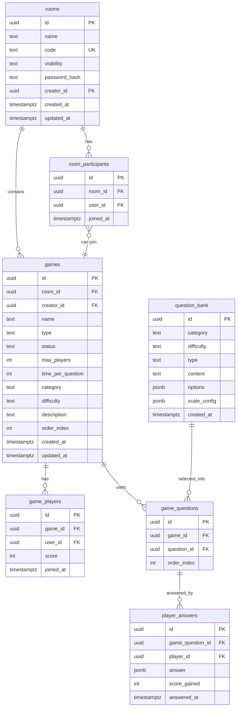

# Gaming Module — Database Plan

**DB Engine:** Supabase / PostgreSQL  
**Auth:** Supabase Auth (`auth.uid()`)

---



---

### helpers

```sql
-- Helper: check if caller is a participant of a room (used by multiple RLS policies)
create or replace function is_room_participant(p_room_id uuid)
returns boolean
language sql
security definer
stable
as $$
  select exists (
    select 1
    from room_participants
    where room_id = p_room_id
      and user_id = auth.uid()
  );
$$;

-- Helper: check if caller is a player in a game
create or replace function is_game_player(p_game_id uuid)
returns boolean
language sql
security definer
stable
as $$
  select exists (
    select 1
    from game_players
    where game_id = p_game_id
      and user_id = auth.uid()
  );
$$;

-- Rollback:
-- drop function if exists is_room_participant(uuid);
-- drop function if exists is_game_player(uuid);
```

---

### 001_rooms

```sql
create table rooms (
  id            uuid primary key default gen_random_uuid(),
  name          text not null check (char_length(name) between 1 and 100),
  code          text not null unique,
  visibility    text not null check (visibility in ('public', 'private')),
  password_hash text,                         -- bcrypt hash; null = no password
  creator_id    uuid not null references auth.users(id) on delete cascade,
  created_at    timestamptz not null default now(),
  updated_at    timestamptz not null default now()
);

-- Fast lookup of public rooms for rooms_wall
create index idx_rooms_visibility_created on rooms (visibility, created_at desc)
  where visibility = 'public';

-- Fast lookup by code (join / private room access)
create index idx_rooms_code on rooms (code);

alter table rooms enable row level security;

-- Public rooms readable by any authenticated user
create policy "rooms_select_public"
  on rooms for select
  using (
    auth.uid() is not null
    and (visibility = 'public' or creator_id = auth.uid() or is_room_participant(id))
  );

-- Only authenticated users can insert; creator_id must match caller
create policy "rooms_insert"
  on rooms for insert
  with check (auth.uid() is not null and creator_id = auth.uid());

-- Only creator can update/delete
create policy "rooms_update"
  on rooms for update
  using (creator_id = auth.uid());

create policy "rooms_delete"
  on rooms for delete
  using (creator_id = auth.uid());

-- Rollback:
-- drop table if exists rooms cascade;
```

---

### 002_room_participants

```sql
create table room_participants (
  id        uuid primary key default gen_random_uuid(),
  room_id   uuid not null references rooms(id) on delete cascade,
  user_id   uuid not null references auth.users(id) on delete cascade,
  joined_at timestamptz not null default now(),
  unique (room_id, user_id)
);

-- Participant list for games_wall with filter/sort on user_name goes through profiles join;
-- index on room_id covers the most common query pattern
create index idx_room_participants_room on room_participants (room_id);

alter table room_participants enable row level security;

-- Participants visible only to other participants of the same room
create policy "room_participants_select"
  on room_participants for select
  using (is_room_participant(room_id));

-- Any authenticated user can join (join validation enforced at API layer — code/password check)
create policy "room_participants_insert"
  on room_participants for insert
  with check (auth.uid() is not null and user_id = auth.uid());

-- Self-removal or room creator can remove
create policy "room_participants_delete"
  on room_participants for delete
  using (
    user_id = auth.uid()
    or exists (
      select 1 from rooms where id = room_id and creator_id = auth.uid()
    )
  );

-- Rollback:
-- drop table if exists room_participants cascade;
```

---

### 003_games

```sql
create table games (
  id                uuid primary key default gen_random_uuid(),
  room_id           uuid not null references rooms(id) on delete cascade,
  creator_id        uuid not null references auth.users(id) on delete cascade,
  name              text not null check (char_length(name) between 1 and 100),
  type              text not null check (type in ('casual')),
  status            text not null default 'game_waiting'
                      check (status in ('game_waiting', 'game_pending', 'game_finished')),
  max_players       int not null check (max_players between 1 and 30),
  time_per_question int not null check (time_per_question > 0),
  category          text not null,
  difficulty        text not null check (difficulty in ('Easy', 'Medium', 'Hard')),
  description       text check (char_length(description) <= 500),
  order_index       int not null default 0,        -- supports sort:order on games_wall
  created_at        timestamptz not null default now(),
  updated_at        timestamptz not null default now()
);

-- Games wall: filter by room; sort by order_index, category, name
create index idx_games_room_order on games (room_id, order_index);
create index idx_games_room_category on games (room_id, category);
create index idx_games_room_name on games (room_id, name);

alter table games enable row level security;

-- Games visible to room participants only
create policy "games_select"
  on games for select
  using (is_room_participant(room_id));

-- Room participants can create games
create policy "games_insert"
  on games for insert
  with check (auth.uid() is not null and creator_id = auth.uid() and is_room_participant(room_id));

-- Only game creator can update (status transitions, etc.)
create policy "games_update"
  on games for update
  using (creator_id = auth.uid());

create policy "games_delete"
  on games for delete
  using (creator_id = auth.uid());

-- Rollback:
-- drop table if exists games cascade;
```

---

### 004_game_players

```sql
create table game_players (
  id        uuid primary key default gen_random_uuid(),
  game_id   uuid not null references games(id) on delete cascade,
  user_id   uuid not null references auth.users(id) on delete cascade,
  score     int not null default 0,
  joined_at timestamptz not null default now(),
  unique (game_id, user_id)
);

create index idx_game_players_game on game_players (game_id);

alter table game_players enable row level security;

-- Visible to room participants (game belongs to a room)
create policy "game_players_select"
  on game_players for select
  using (
    exists (
      select 1 from games where id = game_id and is_room_participant(room_id)
    )
  );

-- Any room participant can join a game (max_players check enforced at API layer)
create policy "game_players_insert"
  on game_players for insert
  with check (
    auth.uid() is not null
    and user_id = auth.uid()
    and exists (
      select 1 from games where id = game_id and is_room_participant(room_id)
    )
  );

-- Players can only update their own score (API layer controls scoring logic)
create policy "game_players_update_score"
  on game_players for update
  using (user_id = auth.uid());

-- Self-removal or game creator can remove a player
create policy "game_players_delete"
  on game_players for delete
  using (
    user_id = auth.uid()
    or exists (
      select 1 from games where id = game_id and creator_id = auth.uid()
    )
  );

-- Rollback:
-- drop table if exists game_players cascade;
```

---

### 005_question_bank

```sql
create table question_bank (
  id          uuid primary key default gen_random_uuid(),
  category    text not null,
  difficulty  text not null check (difficulty in ('Easy', 'Medium', 'Hard')),
  type        text not null check (type in ('multiple_choice', 'text_input', 'scale', 'wild_challenge')),
  content     text not null,
  options     jsonb,        -- Assumption: only populated for multiple_choice; array of strings
  scale_config jsonb,       -- Assumption: only populated for scale; { min, max, step, labels? }
  created_at  timestamptz not null default now()
);

-- Query pattern: select questions by category + difficulty when starting a game
create index idx_question_bank_cat_diff on question_bank (category, difficulty);

alter table question_bank enable row level security;

-- Read-only for authenticated users; write restricted to service role (seed/admin)
create policy "question_bank_select"
  on question_bank for select
  using (auth.uid() is not null);

-- Rollback:
-- drop table if exists question_bank cascade;
```

---

### 006_game_questions

```sql
create table game_questions (
  id           uuid primary key default gen_random_uuid(),
  game_id      uuid not null references games(id) on delete cascade,
  question_id  uuid not null references question_bank(id) on delete restrict,
  order_index  int not null,
  unique (game_id, order_index)
);

create index idx_game_questions_game on game_questions (game_id, order_index);

alter table game_questions enable row level security;

-- Visible to game players
create policy "game_questions_select"
  on game_questions for select
  using (is_game_player(game_id));

-- Inserted by game session logic on game start (API/service role)
create policy "game_questions_insert"
  on game_questions for insert
  with check (
    exists (
      select 1 from games where id = game_id and creator_id = auth.uid()
    )
  );

-- Rollback:
-- drop table if exists game_questions cascade;
```

---

### 007_player_answers

```sql
create table player_answers (
  id               uuid primary key default gen_random_uuid(),
  game_question_id uuid not null references game_questions(id) on delete cascade,
  player_id        uuid not null references auth.users(id) on delete cascade,
  answer           jsonb not null,   -- flexible: string for text_input, int for scale, string[] for multiple_choice
  score_gained     int not null default 0,
  answered_at      timestamptz not null default now(),
  unique (game_question_id, player_id)  -- one answer per player per question
);

create index idx_player_answers_game_question on player_answers (game_question_id);
create index idx_player_answers_player on player_answers (player_id);

alter table player_answers enable row level security;

-- Players can see all answers in their game (needed for score display)
create policy "player_answers_select"
  on player_answers for select
  using (
    exists (
      select 1
      from game_questions gq
      join games g on g.id = gq.game_id
      where gq.id = game_question_id
        and is_game_player(g.id)
    )
  );

-- Players can only insert their own answers
create policy "player_answers_insert"
  on player_answers for insert
  with check (
    auth.uid() is not null
    and player_id = auth.uid()
    and is_game_player(
      (select game_id from game_questions where id = game_question_id)
    )
  );

-- Score update by caller themselves (API layer validates game state before scoring)
create policy "player_answers_update_score"
  on player_answers for update
  using (player_id = auth.uid());

-- Rollback:
-- drop table if exists player_answers cascade;
```
