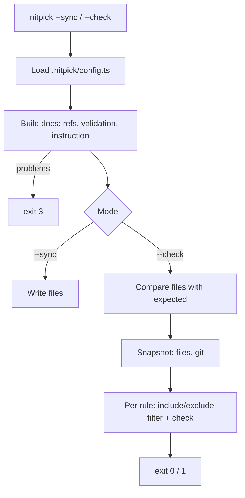

# @repo/nitpick

Keeps AI rules documentation (AODI format) in sync with the code, and runs project checks from the same rule definitions. Config lives in `.nitpick/config.ts`.

## Status

Implemented:

- `--sync` and `--check` (default) modes, exit codes 0/1/2/3
- AODI docs output (default `.ai/AGENTS.md`)
- `knowledge.refs` with `ref()` and `{{ref:key}}` inside knowledge files
- Config validation: missing file, self reference, unknown ref, cycle, duplicate rule `id`
- Check snapshot: `files`, `readText`, `git`, `meta`
- Per-rule `include` / `exclude`
- `rules` as an array or a function
- Ready-made rules: `richCommit`, `logEntry`

Covered by tests: 100% statements, branches, functions and lines (enforced by `test:coverage`; `cli.ts` is excluded).

Not wired yet:

- nitpick is not called from `.husky` hooks or GitHub workflows.

## Rules

A rule has an `id`, an `instruction` function returning Markdown, and an optional `check`.

- `group`: optional "area" of the root docs. Rules sharing a group are rendered under their own `## Rules for <Group>` heading (with the importance sections inside); ungrouped rules stay under `## Rules`, listed first. Groups appear in order of first use. It does not change where instruction files go (always `<path>/rules/<id>.md`).
- `instruction`: a function returning Markdown, or `{ file: './path.md' }` pointing to a Markdown file (relative to `.nitpick/`, absolute paths allowed). A file instruction is written to `<path>/rules/<id>.md`, supports `{{ref:key}}`, and the root docs link to it: `- [id](rules/id.md)`. Missing file or unknown ref is a config error.
- `fix`: text shown after the problems of this rule (`Fix: ...`). Required when the rule has a `check` (type error and config error otherwise). Tell the reader how to correct a violation; include an example.
- `importance`: `A | O | D | I`. Only decides the docs section. Default `A`. Sections: (A) Always, (O) Optional, (D) When directly mentioned, (I) Infer during task. Empty sections are skipped.
- `include` / `exclude`: globs (`path.matchesGlob`), rule level only. They filter `files` passed to `check`. No `include` means all files.
- `id` must be unique.
- Rules run in config order.

## Configuration

```ts
// .nitpick/config.ts
import { config } from '@repo/nitpick/config';
import { richCommit } from '@repo/nitpick/rules/rich-commit';

export default config({
  output: [{ path: '.claude', root: 'CLAUDE.md' }], // default: [{ path: '.ai', root: 'AGENTS.md' }]

  knowledge: {
    dir: 'references', // default: 'references'
    refs: { 'react/state': './knowledge/react/state.md' },
  },

  rules: ({ rule }) => [
    richCommit,
    rule({
      id: 'react-hooks',
      importance: 'A',
      include: ['apps/*/src/**/*.tsx'],
      exclude: ['**/*.test.tsx'],
      instruction: ({ ref }) =>
        `Follow hooks rules. See ${ref('react/state')}.`,
      check: async ({ files, readText, git, report, meta }) => {
        report('message'); // every report is a problem, exit 1
      },
    }),
  ],
});
```

`rules` is an array or a function `({ rule }) => Rule[]`. The function form makes `ref()` suggest keys from `knowledge.refs`. There are no check categories or schedules; `group` only splits the root docs into areas.

Override a ready-made rule by spreading it: `{ ...richCommit, importance: 'D' }`.

### Output

- The first `output` entry gets the full docs: `<path>/<root>` (root docs), `<path>/rules/<id>.md` (file instructions) and `<path>/<knowledge.dir>/<key>.md` (knowledge). Every next entry is a single file with `Follow instructions here: [<first root>](<relative path>)`.
- `ref(key)` in `instruction` becomes a markdown link relative to the root file. Unknown key is a config error.
- `{{ref:key}}` in a knowledge file becomes a link relative to that file.
- Source paths in `refs` are relative to `.nitpick/`. `output.path` and globs are relative to the project root.

### CheckContext

| Field                       | Description                                                                                                                                                                                                                                                 |
| --------------------------- | ----------------------------------------------------------------------------------------------------------------------------------------------------------------------------------------------------------------------------------------------------------- |
| `files`                     | Files from `git ls-files --cached --others --exclude-standard`, sorted, without tracked files deleted from disk, filtered by the rule's `include` / `exclude`. Globs follow `path.matchesGlob`, so `**` does not enter dot folders: use `.ai/**` explicitly |
| `readText(file)`            | Reads UTF-8 text (path relative to project root), cached per run                                                                                                                                                                                            |
| `git.commitMessages`        | Last commit by default; `--commit-msg <file>` uses file content; `--range <a..b>` uses commits in range (invalid range = exit 2)                                                                                                                            |
| `git.stagedAddedFiles` | Files newly added to the index (`git diff --cached --diff-filter=A`), sorted, filtered by the rule's `include` / `exclude` |
| `git.lastCommitMessages(n)` | Last `n` commit messages                                                                                                                                                                                                                                    |
| `report(message)`           | Reports a problem as `[ruleId] message`                                                                                                                                                                                                                     |
| `meta`                      | `{ ruleId, projectRoot }`                                                                                                                                                                                                                                   |

## CLI

```text
nitpick [--sync | --check] [--commit-msg <file>] [--range <a..b>]
```

Root scripts:

```json
{
  "nitpick": "nitpick",
  "nitpick:sync": "pnpm nitpick --sync",
  "nitpick:check": "pnpm nitpick --check"
}
```

- Loads `<cwd>/.nitpick/config.ts`.
- `--sync`: validates config, writes docs and knowledge files. Does not run `check`.
- `--check` (default): reports generated files that differ from disk (`[sync] ... is out of date, run nitpick --sync`), then runs each rule's `check`. Writes nothing.
- `--sync` together with `--check` is a usage error.

| Exit | Meaning                                                                                                        |
| ---- | -------------------------------------------------------------------------------------------------------------- |
| 0    | OK                                                                                                             |
| 1    | Problems: outdated files, `report` from a `check`, or a `check` that threw (`[id] check failed: ...`)          |
| 2    | Usage error or unreadable input (bad flags, missing `--commit-msg` file, invalid `--range`, no git repository) |
| 3    | Config error (import failure, validation, refs)                                                                |

When a rule reports problems, `--check` prints them as `[id] message`, then guidance for an LLM, once per failing rule:

```text
[rich-commit] Footer, trailer, reference or credit not allowed, found "Refs: #1"
Violated rule: rich-commit. Read .ai/rules/rich-commit.md
Fix: Rewrite the commit message as ...
```

The path is the rule's instruction file under the first `output` entry (rules with a function instruction point to the root file). `Fix:` is the rule's `fix` text.

Where to run it (commit hook, pre-push, CI) is up to the consumer.

## `richCommit` rule

Id `rich-commit`, importance `A`. Its instruction lives in the library (`src/rules/rich-commit.md`, next to the rule; `.md` files in `src/rules` are copied to `dist` on build) and is generated as `rules/rich-commit.md`. Validates `git.commitMessages`:

- Subject `type(scope)!: title`; types: `feat fix docs style refactor perf test build ci chore revert`; scope required.
- Blank line after the subject.
- Body contains at least one `- ` change list item.
- Body is only a `- ` list (nested `  - ` items allowed). Nothing may follow it: no blank lines, prose, footers, `Key: value` trailers, references (`Refs`, `Fixes`, `Closes`), `Co-authored-by`, `Signed-off-by` or AI credits.

## `logEntry` rule

Id `log-entry`, group `general`, importance `A`. Instruction `src/rules/log-entry.md`. Validates `git.stagedAddedFiles` (works with `--commit-msg`, i.e. in the `commit-msg` hook):

- At least one newly staged file `<...>/__log__/<NNNN>-<slug>.md`. Modified or unstaged logs do not count.
- First line `# <NNNN> - <summary>` with the same number as the file name.
- A json `"status"`: `done`, `failed` or `done-with-clarification`.

## Flow



The engine gives repeatable input and stable result order. A `check` must avoid depending on time and network if its result is to stay deterministic.

## Package

- Imports: `@repo/nitpick/<module>` (`config`, `rules/rich-commit`), exported from `dist`.
- Bin: `nitpick` (`dist/cli.js`).
- Scripts: `build`, `dev`, `check-types`, `lint`, `test`, `test:coverage`.
